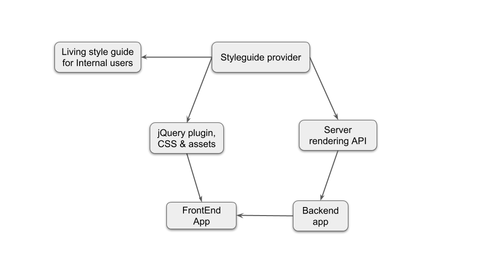

# Vanilla javascript live styleguide #
Boilerplate to be use as a starter styleguide.

## Instalation ##
Go into the project folder and execute `npm install`

## Features ##
This project have following features enabled as default:
- Node/ExpresJS server for styleguide navigation
- EJS template system
- Webpack to bundle the app
- PostCSS with CSSNext
- Babel that transpile ES6 to support older browsers 
- Build your styleguide as a jQuery plugin (jQuery not included)

## Usage ##
To manage the deployment process and launch the different features you have run following npm scripts:
- To start styleguide development use `npm run develop`
- To do a build for development purposes use `npm run build`
- To do a production build use `npm run build:prod`
- To start the server use `npm run server`. 
- To start render service use `npm run render-service`

```js
$('body').styleguide({
  path: 'atoms/text-input'
  options: { /*.. Options Object ..*/ }
})
```
If any of the options are not defined it will use defaults.

## Add new components into styleguide ##
If you want to add a component into an existing page (eg: component inside atoms page) follow next steps:
1. Create *component.ejs* file that should contain a valid EJS template. 
2. Create *component.js* file will export an object that contain the whole component. This object should have at least three *name*, *render* and *defaults*. Check example: 
```js
import componentRender from './component.ejs'
{
  name: 'component',
  render: componentRender,
  defaults: {}
}
```
4. Edit *src/common/templates/atoms/index.js* to import the component and add it to the list of :
```js
import component from './text-input.js'

const atoms = [
  // ...
  component
].map( elem => ({page: 'atoms', ...elem}) )
```
1. If you are creating a new page you should repeat the same steps as above to add a component and register the page as follows *src/common/templates/index.js* (eg: newPage):
```js
import newPage from './newPage'; // Don't forget to import

// ------- Add here new pages here components -------- //
const all = [
  page,
  ...atoms,
  ...molecules,
  ...newPage, // Spread all components contained in newPage
]
// ---------------------------------------------------- //
```
You should create a index.js file into the newpage with same structure as describe under point 3.

With this features you achieve a delivery workflow like:


## TODO ##
- Finish server side rendering Service
- Optimise production builds
- Adapt scripts and webpack config for a better dev workflow
- Dinamically fetch styles when using jQuery Plugin
